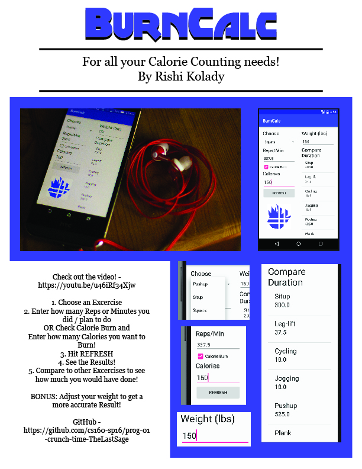

# PROG 01: Crunch Time

A quick and easy way to count your calories when working out, or planning your workout!

## Authors

Rishi Kolady ([koladyr@berkeley.edu](mailto:koladyr@berkeley.edu))

## Demo Video

See [BurnCalc] (https://youtu.be/u46iRf34Xjw)

## Screenshots

## Acknowledgments

* Hat tip to anyone who's code was used
* Any other support

*Feel free to enhance your README. For Markdown syntax, see [the GitHub Guides](https://guides.github.com/features/mastering-markdown/). Remove this line in your submission.*
